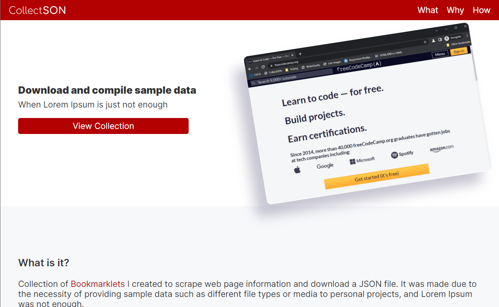

# CollectSON

(acronym for Collection JSON) Extract and download page information as a collection of text or URL's to JSON.

## What is it?

Collection of [Bookmarklets](https://en.wikipedia.org/wiki/Bookmarklet) I created to scrape web page information and download a JSON file. It was made due to the necessity of providing sample data such as different file types or media to personal projects, and Lorem Ipsum was not enough.

## Why use it?

Simple, Who got time for that? Just grab the samples and get back to the fun stuff. Working smart and not hard rings true for this one.

## How to use it?

Drag the bookmarklet link from the info page to your browser bookmarks or right click and bookmark it, that simple.

### Collection of Bookmarklets

#### Youtube+CollectSON

Extract all public videos embed URL from a [Youtube.com](https://www.youtube.com/) channel through the videos tab (e.g. https://www.youtube.com/@KevinPowell/videos). Along with the video title, runtime, and thumbnail URL.

--

#### Facts+CollectSON

Extract a country's facts title text from [Facts.net](https://facts.net) (e.g. https://facts.net/indonesia-facts/).

--

#### Hundeo+CollectSON

Extract all dog breeds name and image URL facts from [Hundeo.com](https://www.hundeo.com/en/dog-breeds/)

--

#### Wikipedia+CollectSON

Extract all dog breeds name and wiki page URL from [Wikipedia.org](https://en.wikipedia.org/wiki/List_of_dog_breeds)
